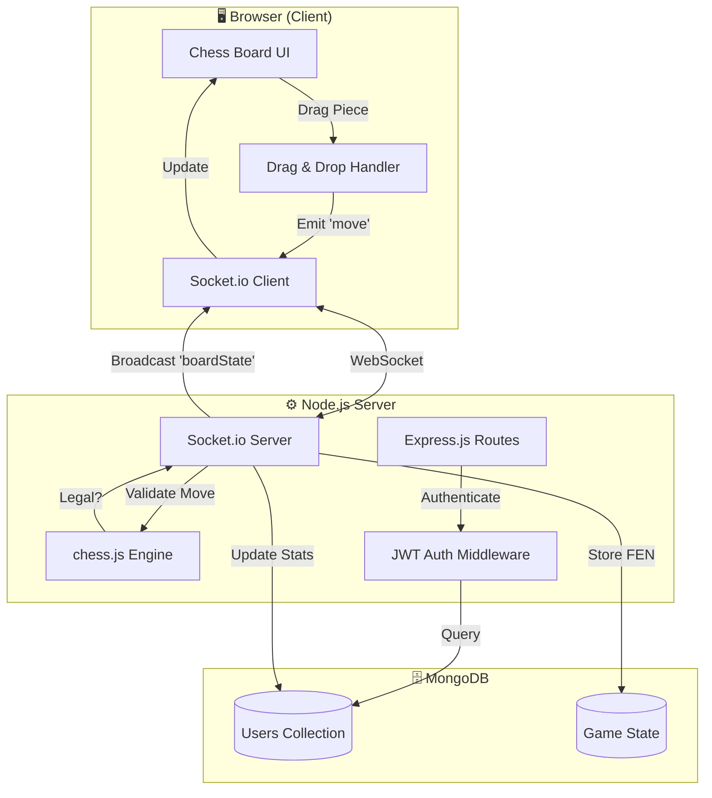

<p align="center">
  
</p>

<h1 align="center">♟️ Super Chess</h1>
<h3 align="center">Real-Time Multiplayer Chess with Live Chat & Spectator Mode</h3>

<p align="center">
  
  
  
  
  
</p>

---

## 🎯 What Is This?

**Super Chess** is an online chess platform where two players can compete in real-time, chat during their match, and have others watch the game live—all from their web browser.

> **The Elevator Pitch:**  
> Imagine playing chess with a friend across the world, seeing their moves appear instantly on your screen, trash-talking in a live chat, while your other friends spectate and cheer you on. That's Super Chess—a complete multiplayer chess experience built from scratch.

---

## 🧠 The Analogy: Understanding the System

**Think of Super Chess like a professional chess tournament:**

| Real World | Super Chess |
|------------|-------------|
| 🏟️ **The Tournament Hall** | The Express.js server hosting everything |
| 📋 **The Referee** | The `chess.js` engine validating every move |
| 📡 **The Live Broadcast System** | Socket.io pushing moves to all connected screens |
| 🎙️ **The Commentary Booth** | The real-time chat system |
| 👀 **The Audience Seats** | Spectator mode for non-players |
| 🏆 **The Leaderboard** | MongoDB storing wins, losses, and rankings |

When a player moves a piece, the "referee" checks if it's legal. If valid, the "broadcast system" instantly updates everyone's screen—players AND spectators. If someone tries to cheat or make an illegal move, the referee blocks it before anyone sees it.

---

## ✨ Key Features

### For Players
- ♟️ **Real-Time Gameplay** — Moves appear instantly on your opponent's screen
- 🔄 **Automatic Turn Enforcement** — Can't move out of turn; the system knows whose move it is
- 👑 **Full Chess Rules** — Checkmate, stalemate, draws, castling, pawn promotion—all built in
- 💬 **Live Chat** — Talk to your opponent (with profanity filtering!)
- 📊 **Personal Stats** — Track your games played, wins, losses, and win rate

### For Spectators
- 👁️ **Watch Any Game** — Join as a spectator without affecting the match
- 📺 **Live Updates** — See every move as it happens

### For Everyone
- 🏆 **Global Leaderboard** — See who the best players are
- 🖼️ **Profile Customization** — Upload your own profile picture
- 🔐 **Secure Accounts** — Password hashing & JWT authentication

---

# 🛠️ Engineering Deep Dive

## System Architecture



### Data Flow: Making a Move

```
1. Player drags ♞ Knight from B1 to C3
       ↓
2. Client converts to algebraic notation: { from: "b1", to: "c3" }
       ↓
3. Socket.io emits 'move' event to server
       ↓
4. Server validates:
   ├── Is it this player's turn? (white/black check)
   ├── Is the move legal? (chess.js validation)
   └── Does it result in checkmate/stalemate?
       ↓
5. If valid: Broadcast new board state (FEN) to ALL connected clients
   If invalid: Send 'invalidMove' only to the player who tried
       ↓
6. All clients update their boards simultaneously
```

---

## 🧩 Technical Challenges Solved

### Challenge 1: Real-Time State Synchronization

**The Problem:** When two players make moves, both screens need to show the exact same board state. Network latency could cause screens to go out of sync.

**The Solution:** 
- Server is the **single source of truth**
- Board state stored as **FEN notation** (a compressed string representing the entire board)
- Every move triggers a broadcast of the **complete board state**, not just the move
- Clients always `chess.load(fen)` instead of tracking moves locally

```javascript
// Server broadcasts the authoritative state
io.to(currentGameId).emit('boardState', chess.fen());

// Client always syncs to server's truth
socket.on('boardState', (fen) => {
    chess.load(fen);  // Replace local state entirely
    renderBoard();     // Re-render from authoritative source
});
```

### Challenge 2: Drag-and-Drop with Board Flipping

**The Problem:** The black player sees the board flipped (their pieces at the bottom). Drag-and-drop coordinates need to work correctly for both perspectives.

**The Solution:** CSS transformation + coordinate translation:

```javascript
// Board flips via CSS for black player
if (playerRole === 'b') {
    boardElement.classList.add('flipped');
}

// Pieces counter-rotate to stay upright
.flipped .piece { transform: rotate(180deg); }

// Coordinates calculated from data attributes, not visual position
const move = {
    from: `${String.fromCharCode(97 + source.col)}${8 - source.row}`,
    to: `${String.fromCharCode(97 + target.col)}${8 - target.row}`
};
```

### Challenge 3: Player Slot Management

**The Problem:** Need to handle players joining, leaving mid-game, and spectators—without race conditions.

**The Solution:** Socket-to-player mapping with state machine:

```javascript
// Server tracks who's who
let players = {
    white: { socketId, userId, username },
    black: { socketId, userId, username }
};

// On disconnect: award win to remaining player
socket.on('disconnect', async () => {
    if (socket.id === players.white?.socketId) {
        await updateGameStats(players.black.userId, players.white.userId);
        io.emit('gameOver', 'White disconnected. Black wins!');
    }
});
```

### Challenge 4: Chat Moderation at Scale

**The Problem:** Prevent toxic messages without blocking legitimate chat.

**The Solution:** Server-side word filter with regex boundary matching:

```javascript
const filterMessage = (message) => {
    badWords.forEach(word => {
        const regex = new RegExp(`\\b${word}\\b`, 'gi');  // Word boundaries
        message = message.replace(regex, '****');
    });
    return message;
};
```

---

## 📚 The Stack: Why Each Technology?

| Technology | Purpose | Why This Choice? |
|------------|---------|------------------|
| **Node.js + Express** | Backend server | Non-blocking I/O perfect for real-time apps; JavaScript everywhere |
| **Socket.io** | Real-time communication | Handles WebSocket fallbacks, reconnection, rooms (for games) |
| **chess.js** | Game rule engine | Battle-tested library; handles all chess rules including edge cases |
| **MongoDB + Mongoose** | Database | Flexible schema for user stats; easy to extend for game history |
| **JWT + bcrypt** | Authentication | Stateless auth tokens; industry-standard password hashing |
| **Tailwind CSS** | Styling | Rapid UI development; consistent design system |
| **EJS** | Server-side templates | Simple templating for server-rendered pages |
| **Multer** | File uploads | Handle profile picture uploads with ease |

---

## 📁 Project Structure

```
Super_Chess/
├── app.js                    # Main server: routes + socket handlers
├── package.json              # Dependencies
│
├── config/
│   └── multerconfig.js       # File upload configuration
│
├── models/
│   └── user.js               # Mongoose schema (username, stats, etc.)
│
├── public/
│   ├── js/
│   │   └── chessgame.js      # Client-side game logic & socket handling
│   └── images/
│       └── uploads/          # Profile pictures
│
└── views/                    # EJS Templates
    ├── login.ejs             # Login page
    ├── register.ejs          # Registration page
    ├── dashboard.ejs         # Main menu
    ├── chess.ejs             # Game board UI
    ├── chat.ejs              # Chat interface
    ├── spectate.ejs          # Watch active games
    ├── profile.ejs           # User profile
    ├── profileupload.ejs     # Upload profile picture
    ├── leaderboard.ejs       # Rankings
    ├── users.ejs             # User list
    └── error.ejs             # Error display
```

---

# 🚀 Getting Started

## Prerequisites

Before you begin, make sure you have:

| Requirement | Version | Check Command |
|-------------|---------|---------------|
| Node.js | v18+ | `node --version` |
| npm | v9+ | `npm --version` |
| MongoDB | v6+ | `mongod --version` |
| Git | Any | `git --version` |

## Step-by-Step Installation

### 1️⃣ Clone the Repository

```bash
git clone https://github.com/sairishigangarapu/Super_Chess.git
cd Super_Chess
```

### 2️⃣ Install Dependencies

```bash
npm install
```

### 3️⃣ Start MongoDB

**On Windows (if installed as service):**
```bash
net start MongoDB
```

**On macOS/Linux:**
```bash
mongod --dbpath /path/to/your/data/folder
```

**Using Docker:**
```bash
docker run -d -p 27017:27017 --name chess-mongo mongo:latest
```

### 4️⃣ Configure Environment Variables

Create a `.env` file in the root directory:

```env
# Server Configuration
PORT=3000
NODE_ENV=development

# Database
MONGODB_URI=mongodb://127.0.0.1:27017/chessgame

# Authentication
JWT_SECRET=your-super-secret-key-change-in-production

# Optional: Session expiry (in seconds)
JWT_EXPIRES_IN=86400
```

> ⚠️ **Security Note:** Never commit your `.env` file. The `.gitignore` should already exclude it.

### 5️⃣ Start the Server

```bash
node app.js
```

You should see:
```
Server running on port 3000
```

### 6️⃣ Open in Browser

Navigate to: **http://localhost:3000**

---

## 🎮 How to Play

1. **Register** an account (or login if you have one)
2. Click **"Play"** from the dashboard
3. **First player** to join becomes **White** ♔
4. **Second player** becomes **Black** ♚
5. **Third+ players** become **Spectators** 👁️
6. **Drag and drop** pieces to make moves
7. Game ends on **checkmate**, **stalemate**, or **disconnect**

---

## 📄 License

This project is licensed under the **ISC License**. See [LICENSE](LICENSE) for details.

---

## 🤝 Contributing

Contributions are welcome! Please feel free to submit a Pull Request.

1. Fork the repository
2. Create your feature branch (`git checkout -b feature/AmazingFeature`)
3. Commit your changes (`git commit -m 'Add some AmazingFeature'`)
4. Push to the branch (`git push origin feature/AmazingFeature`)
5. Open a Pull Request

---

## 👨‍💻 Author

**Sai Rishi Gangarapu**

- GitHub: [@sairishigangarapu](https://github.com/sairishigangarapu)

---

<p align="center">
  <b>Made with ♟️ and ☕</b>
</p>
